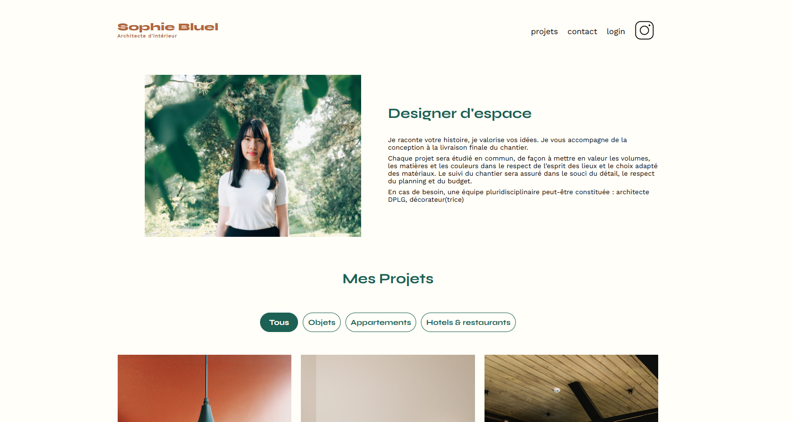

Site Sophie Bluel

Ce dépôt correspond au projet 3 de la formation Développeur Web d'OpenClassrooms.

Il consiste en la création d'une page d'accueil web dynamique avec JavaScript. 

Les objectifs étaient : 
- de gérer les événements utilisateurs avec JavaScript
- de Manipuler les éléments du DOM avec JavaScript
- de récupérer les données utilisteurs dans le JavaScript via des formulaires

La technologie utilisée pour ce projet : 
- HTML 5
- CSS 3
- JavaScript
- Git et GitHub pour le versionning

J'ai validé ce projet le 18 juin 2024.

Les points forts de mes livrables : 
- les événements utilisateurs sont correctement gérés
- les works sont bien repris de l'API
- les données sont bien récupérées via le formulaires
- le code est propre et clair

Mes difficultés pour ce projet : 
- comprendre le fonctionnement d'une API et comprendre comment échanger avec elle
- la gestion du DOM
